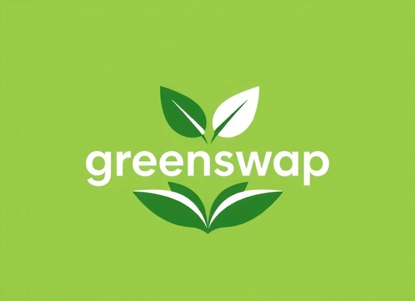

<html lang="de">
<head>
<meta charset="UTF-8">
<meta name="viewport" content="width=device-width, initial-scale=1.0">
<title>GreenSwap – Nachhaltig teilen</title>

</head>

<body>

<nav>
    

        
    

    

        <a href="#idee">Idee</a>
        <a href="#video">Pitch</a>
        <a href="#termin">Termin</a>
    

</nav>

<section class="hero">
    <h1>GreenSwap</h1>
    
 Tauschen statt Wegwerfen.

    

        Nachhaltig. Lokal. Kostenlos.
    

</section>

<section id="idee">
    

        <h2>Warum braucht es GreenSwap?</h2>
    

    

        Jedes Semester werden unzählige funktionierende Gegenstände entsorgt,
        obwohl sie noch genutzt werden könnten. Gerade Studierende besitzen vieles
        nur temporär – und zahlen am Ende doppelt: mit Geld und Umweltkosten.
    

    

        <strong>GreenSwap setzt genau hier an:</strong> 
        Wir verbinden Studierende lokal miteinander, damit Dinge weiterverwendet
        statt weggeworfen werden.
    

</section>

<section>
    

        <h2>Was macht GreenSwap besonders?</h2>
    

    

        

            🌱 <strong>Nachhaltig & sinnvoll</strong> 
            Gegenstände werden weitergegeben statt weggeworfen –
            das spart Ressourcen und Müll.
        

        

            🎓 <strong>Speziell für Studierende</strong> 
            Viele Dinge werden nur für kurze Zeit gebraucht –
            GreenSwap erleichtert den Austausch unter Studierenden.
        

        

            🤝 <strong>Einfach & lokal</strong> 
            Tauschen innerhalb der eigenen Stadt oder Hochschule,
            ohne Versand oder Kosten.
        

    

</section>

<section>
    

        <h2>So funktioniert GreenSwap</h2>
    

    

        

            📦 <strong>1. Einstellen</strong> 
            Studierende stellen Gegenstände ein, die sie nicht mehr benötigen
            (z. B. Möbel, Küchengeräte oder Lernmaterialien).
        

        

            🔍 <strong>2. Finden</strong> 
            Andere Studierende aus der Nähe sehen die Angebote
            und finden genau das, was sie gerade brauchen.
        

        

            🤝 <strong>3. Tauschen & Abholen</strong> 
            Die Übergabe erfolgt direkt und lokal – kostenlos,
            unkompliziert und nachhaltig.
        

    

</section>

<section id="video">
    

        <h2>MVP Pitch-Video</h2>
    

    

        In unserem Pitch-Video erklären wir die Idee, das Problem
        und warum GreenSwap ein nachhaltiger Lösungsansatz ist.
    

   

    <iframe width="560" height="315"
        src="https://www.youtube.com/embed/PDAm-zsWw5Q?si=AIV1t3AgYJtAQ58E"
        title="GreenSwap Pitch Video"
        frameborder="0"
        allow="accelerometer; autoplay; clipboard-write; encrypted-media; gyroscope; picture-in-picture; web-share"
        referrerpolicy="strict-origin-when-cross-origin"
        allowfullscreen>
    </iframe>

</section>

<section id="termin">
    

        <h2>Interesse geweckt?</h2>
    

    

        Wir freuen uns über Feedback, Fragen oder Austausch zur Idee.
        Buchen Sie gerne einen Termin mit dem Projektteam.
    

  

    <a href="https://calendly.com/khetibyasmin7/neues-meeting?month=2026-01" target="_blank">
        Termin buchen
    </a>

</section>

<footer>
    © 2025 GreenSwap – Hochschulprojekt von Hannah & Yasmin
</footer>

</body>
</html>

